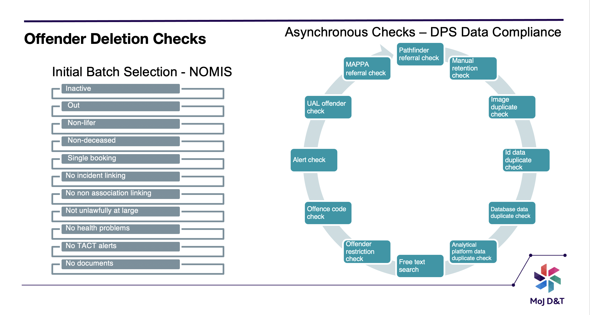

[< Back](../README.md)
---

## Configuring Checks

In order to delete an offender record, we must ensure we have the ability to do so in accordance with HMPPS retention
policy.

There are a number of checks that we have introduced in order to help make this decision.

Please see the below illustration to understand what these checks are:

---
The `Image Duplicate Check` is used to identify if the offender images matches any other offenders images. This enables us to identify
duplicates.

This can be configured as follows:

`OFFENDER_RETENTION_IMAGE_DUPLICATE_CHECK_ENABLED: true`

---

The `ID Dupliacate Check` is used to identify duplicates using CRO number, LIDS number & PNC number.

This can be configured as follows:

`OFFENDER_RETENTION_DATA_DUPLICATE_ID_CHECK_ENABLED`

---

The `Analytical Dupliacate Check` is used to identify duplicates using the Analytical Platform.

This can be configured as follows:

`OFFENDER_RETENTION_DATA_DUPLICATE_AP_CHECK_ENABLED: true`

---
The `False Positive Dupliacate Check` is used to increase the accuracy of the duplicate decision and avoid false
positives.

This can be configured as follows:

`OFFENDER_RETENTION_FALSE_POSITIVE_DUPLICATE_CHECK_ENABLED: true`

---

The `MAPPA check` (Multi-agency public protection arrangements) is in place to ensure the successful retention of
violent and sexual offenders where required according to policy.

This can be configured as follows:

`OFFENDER_RETENTION_FALSE_POSITIVE_DUPLICATE_CHECK_ENABLED: true`

---
The `Deletion Grant` is a switch that allows you to switch deletions off, despite checks being configured to run.

This can be configured as follows:

`DELETION_GRANT_ENABLED: true`

---
The `Data Duplicate Check` is used to check nomis data to identify duplicates. **This must be switched off** until the
corresponding Materialised View is enabled in NOMIS. Please note, this check is optional and is not required in order to
delete offender data.

This can be configured as follows:

`OFFENDER_RETENTION_DATA_DUPLICATE_DB_CHECK_ENABLED: false`

